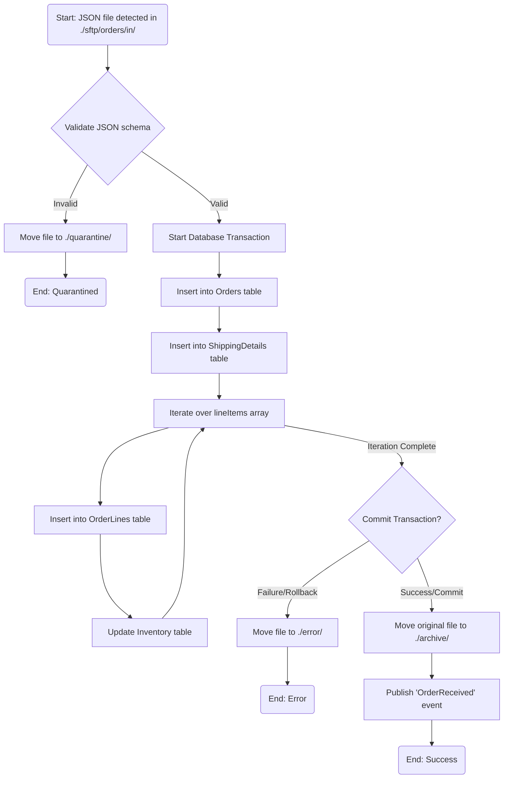
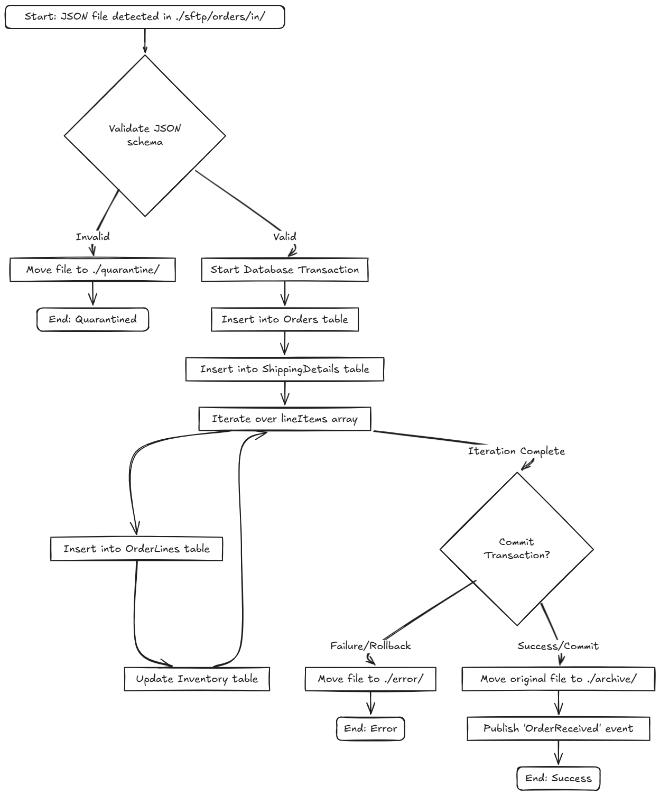

# Use Case: Ingest, Transform, Load: Ingesting JSON Orders into a Database

In this integration, we will build a robust workflow to ingest e-commerce orders submitted as JSON files. We will configure an FTP service to monitor a directory for new order files. Upon detection, the integration will read the file, validate its schema, and then use a database transaction to process the nested JSON data. This involves inserting the main order details, customer shipping information, and iterating over the list of line items to populate multiple database tables. Finally, the original file will be archived.

## Scenario
Partner marketplaces (like Amazon, Shopify) or B2B portals drop new orders as individual JSON files into a secure SFTP folder for fulfillment. These files contain nested data, including customer details and a list of products (line items).

--- Notes

code: samples/etl

