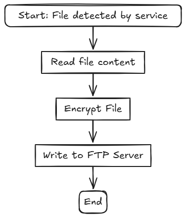
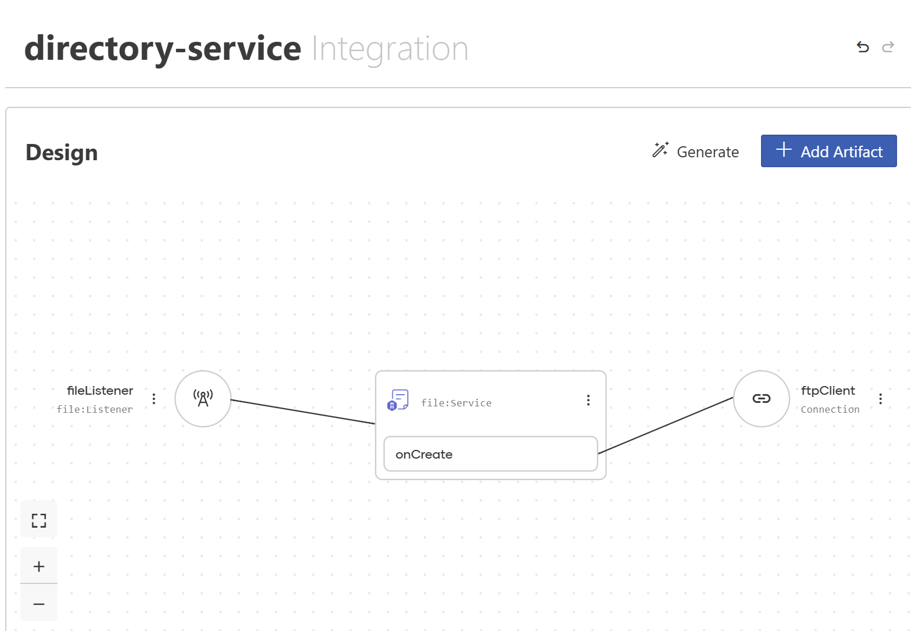
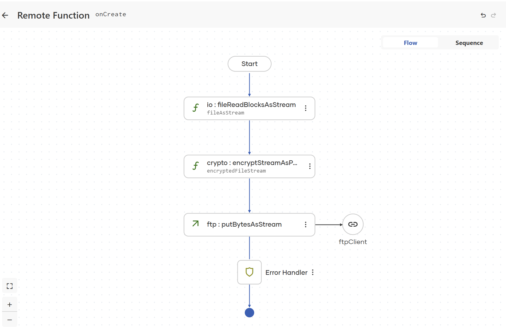

# Usecase: Watch a Directory, Encrypt Files, Upload

This hands-on example shows how WSO2 Integrator: BI can watch a local folder for new files, encrypt each file, and upload it to a secure target location (another directory or remote FTP/SFTP/FTPS server).

--- Notes

Sample: samples/directory_service
// TODO Need an FTP release

